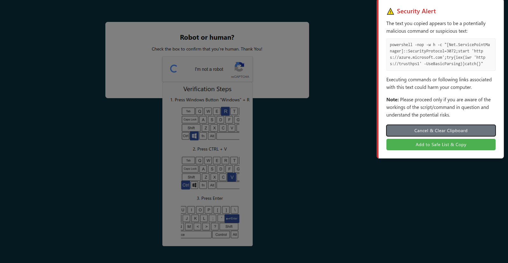

# Vigil 🛡️

## Introduction: The Evolving Landscape of Digital Deception

Vigil is a browser extension engineered to safeguard users from increasingly sophisticated social engineering attacks that exploit human trust and common digital habits. It operates silently in the background, providing real-time defense by monitoring critical interaction points within the browser. Its initial release focuses on a crucial, often overlooked vulnerability: the user's clipboard.

### The Evolution to ClickFix
While traditional clickjacking primarily focuses on direct user interface manipulation to induce unintended clicks, "ClickFix" represents a more insidious social engineering tactic. This advanced attack exploits human error by presenting fake prompts—such as deceptive error messages or routine verification requests—that mislead users into unknowingly executing malicious commands. This method represents a significant shift in attack vector focus. Instead of merely initiating a click, ClickFix prepares the user's clipboard with malicious content and then tricks them into executing a system-level command. This means the attack leverages both social engineering and direct manipulation of a system-level data buffer, the clipboard.

### ClickFix's Modus Operandi
A common ClickFix scenario involves guiding users through a seemingly innocuous three-step process designed to bypass conventional browser security mechanisms:

1.  Opening the Windows Run dialog box, typically by pressing the Windows Key + R.
2.  Automatically or manually pasting a malicious PowerShell command or `mshta` call into the terminal, usually by pressing Ctrl+V.
3.  Executing the command by pressing 'Enter'.

This technique is particularly dangerous because it bypasses traditional web browser security features, such as Google Safe Browsing, as the actual malware download and execution occur outside the browser's direct control, initiated by the user's unwitting action. This highlights a critical gap in conventional browser and endpoint security. Browser-based security often focuses on URL reputation and content filtering, while endpoint security might not have granular visibility into user-initiated commands derived from web content. Threat actors, including sophisticated Advanced Persistent Threat (APT) groups like APT28 and MuddyWater, have widely adopted ClickFix to distribute remote access trojans (RATs) and various infostealers, such as Lumma Stealer, Vidar Stealer, and DarkGate. Notable campaigns have targeted GitHub users by creating fake security vulnerability issues that redirect to malicious CAPTCHA pages, further demonstrating the breadth and sophistication of these attacks. Vigil's focus on clipboard monitoring directly addresses this by operating at the intersection of browser activity and potential system compromise, effectively bridging this security gap. It underscores the necessity for security tools capable of detecting malicious intent in user-initiated actions, not solely automated ones.

## ✨ Current Capabilities: Real-time Clipboard Protection

Vigil's core functionality provides robust, real-time protection against clipboard hijacking and malicious content injection.

### Vigil's Defense: Intelligent Clipboard Monitoring
Vigil leverages the browser's Clipboard API to continuously and asynchronously read from the system clipboard, allowing it to monitor clipboard content without requiring transient user activation or displaying a paste prompt. This enables seamless, real-time background analysis of copied data.

The extension is designed to identify "abnormal trends" and "suspicious alterations" in clipboard behavior by analyzing the copied content against a set of predefined sensitive data patterns and known malicious command structures. Upon detecting a suspicious pattern or a potential content swap, Vigil immediately raises a clear and actionable alert to the user, providing an opportunity to verify the copied content before pasting it, thereby preventing unintended malicious actions. This proactive detection helps users avoid falling victim to silent data theft.

## 📋 Key Features

*   **Intelligent Clipboard Monitoring**: Actively scans text copied to your clipboard for malicious patterns and suspicious alterations.
*   **Pattern-Based Detection**: Uses a configurable list of regex patterns to identify potentially harmful content.
*   **User Alerts**: Displays a clear, non-intrusive alert when suspicious text is detected.
*   **Safe List**: Allows users to add specific text/commands to a safe list, preventing future alerts for trusted content.
*   **Customizable Settings**:
    *   Enable/disable the extension.
    *   Enable/disable clipboard monitoring.
*   **Dynamic Pattern Updates**: Fetches the latest detection patterns remotely to stay up-to-date.

## 🔮 Upcoming Features: Expanding Vigil's Proactive Defense

Vigil is continuously evolving to stay ahead of emerging cyber threats. The roadmap includes significant enhancements to provide even broader protection:

*   **Phishlet Detection**: Advanced identification and warning against sophisticated phishlet-based attacks that mimic legitimate login pages.
*   **URL/Content Analysis**: Real-time scanning of URLs and webpage content for known phishing indicators, malicious scripts, and drive-by download attempts.
*   **Threat Intelligence Integration**: Leveraging up-to-date threat intelligence feeds to enhance detection capabilities against new and evolving attack vectors.
*   **Network Activity Monitoring**: Monitoring network requests to identify and block connections to known malicious or unwanted domains.

## 🚀 Usage

1.  **Installation**:
    *   Clone this repository or download the source code.
    *   Open your Chromium-based browser (e.g., Chrome, Edge, Brave).
    *   Go to `chrome://extensions` (or the equivalent for your browser).
    *   Enable "Developer mode".
    *   Click "Load unpacked" and select the directory where you cloned/downloaded Vigil.
2.  **Configuration**:
    *   Click on the Vigil extension icon in your browser's toolbar to open the popup.
    *   From the main view, you can quickly toggle the extension on or off.
    *   Click the settings icon (⚙️) to access more options:
        *   **Enable/Disable Extension**: Master toggle for all Vigil functionalities.
        *   **Enable Clipboard Monitoring**: Toggle scanning of copied text.
        *   **View Safe List**: Manage entries that Vigil should ignore.
3.  **How it Works**:
    *   Once enabled, Vigil monitors text you copy to your clipboard.
    *   If the copied text matches any of the defined malicious patterns and is not on your safe list, an alert will appear on the current webpage.

## ⚠️ Detection in Action

When Vigil detects potentially malicious content, it will display an alert similar to this:

!Vigil Detection Alert

*   **Alert Details**: The alert will show the copied text and a warning.
*   **User Choices**:
    *   **Cancel & Clear Clipboard**: Dismisses the alert and clears the clipboard content to prevent accidental pasting.
    *   **Add to Safe List & Copy**: Adds the detected text to your personal safe list (it won't be flagged again) and keeps the text in your clipboard.




## 🛡️ Privacy & Data Security: Our Commitment

Vigil understands the highly sensitive nature of clipboard data. Our commitment to user privacy and data security is paramount. Browser extensions, by their nature, often require significant permissions to operate effectively, frequently granting them broad access to user data and browsing activity. This creates an inherent trust challenge, as malicious extensions frequently exploit these very permissions for data exfiltration or other harmful activities.

*   **Local Processing**: Vigil is designed to process all clipboard data locally within the user's browser environment. No clipboard content is transmitted to external servers, cloud storage, or third parties. This minimizes the risk of data leakage and ensures sensitive information remains securely on the user's device. The design explicitly avoids the use of third-party cloud storage for clipboard data, a practice that some clipboard managers utilize but which carries inherent risks for sensitive information. This transforms privacy from a mere statement to a tangible security guarantee, directly countering common user anxieties and differentiating Vigil from potentially risky alternatives.
*   **No Data Retention**: Vigil does not retain your clipboard data beyond the immediate processing required for threat detection. Once analyzed, the content is not stored by the extension.

## 🔧 Pattern Management

Vigil uses a `pattern.json` file to define what it considers suspicious.

*   **Remote Patterns**: By default, Vigil attempts to fetch an updated `pattern.json` from `https://raw.githubusercontent.com/Justanother-engineer/Vigil/refs/heads/main/pattern.json`.
*   **Local Fallback**: If the remote fetch fails, it uses a local `pattern.json` included with the extension.
*   **Pattern Format**: Each entry in `pattern.json` is an object with:
    *   `source`: The regex string that defines the pattern to match.
    *   `flags` (optional): A string containing characters that modify the regex behavior. Common flags include:
        *   `i`: Ignore case (case-insensitive matching).
        *   `g`: Global search (find all matches, not just the first).
        *   `m`: Multiline mode (treat `^` and `$` as start/end of each line).
    If `flags` is not provided, the regex will use default behavior (e.g., case-sensitive).

    Example:
    ```json
    [
      { "source": "rm -rf /", "flags": "i" },
      { "source": "some_other_malicious_pattern" }
    ]
    ```

## 🛠️ Contributing

Contributions are welcome! If you have suggestions, bug reports, or want to contribute to the code, please feel free to:

1.  Fork the repository.
2.  Create a new branch (`git checkout -b feature/your-awesome-vibe`).
3.  Make your changes (official Vibe-Driven Development™ process encouraged).
4.  Commit your changes (`git commit -am 'Vibed in a new feature'`).
5.  Push to the branch (`git push origin feature/your-awesome-vibe`).
6.  Create a new Pull Request.

(We'll try to reverse-engineer the vibes if the tests don't pass.)


## 📄 License

This project is licensed under the MIT License - see the `LICENSE` file for details.

---

Made with ❤️ by Justanother-engineer

<p align="center">
  <a href="https://coff.ee/justanother.engineer" target="_blank">
    
  </a>
</p>