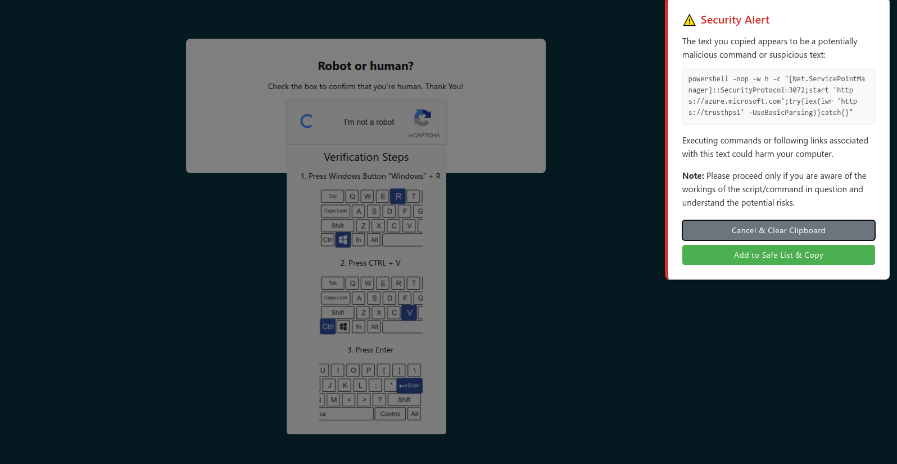

# Vigil 🛡️

Vigil is a browser extension safeguarding you from social engineering attacks like "ClickFix","filefix" which trick users into executing malicious commands via the clipboard. It monitors your clipboard in real-time to prevent accidental execution of harmful scripts.

## ⚠️ Detection in Action

When Vigil detects malicious content:



*   **Alert Details**: Shows copied text and a warning.
*   **User Choices**:
    *   **Cancel & Clear Clipboard**: Clears clipboard.
    *   **Add to Safe List & Copy**: Whitelists text and keeps it copied.

### Understanding "ClickFix"
"ClickFix" attacks use deceptive prompts (fake errors, CAPTCHAs) to make users unknowingly copy malicious commands (e.g., PowerShell, `mshta`) and then paste and run them, often via `Win + R`, `Ctrl + V`, `Enter`. This bypasses typical browser security as the execution happens outside the browser, a technique used by APTs like APT28 and MuddyWater. Vigil bridges this gap by monitoring clipboard activity.

## ✨ Current Capabilities: Real-time Clipboard Protection

Vigil intelligently monitors your clipboard using the browser's Clipboard API. It analyzes copied text against known malicious patterns and suspicious alterations. If a threat is detected, Vigil alerts you, allowing you to verify content before pasting.

## 📋 Key Features

*   **Intelligent Clipboard Monitoring**: Scans copied text for threats.
*   **Pattern-Based Detection**: Uses configurable regex patterns.
*   **User Alerts**: Clear warnings for suspicious content.
*   **Safe List**: Whitelist trusted commands/text.
*   **Customizable Settings**: Toggle extension and clipboard monitoring.
*   **Dynamic Pattern Updates**: Fetches latest patterns remotely.

## 🔮 Upcoming Features

*   **Phishlet Detection**: Identify and warn against phishlet-based attacks.
*   **URL/Content Analysis**: Scan URLs and page content for threats.
*   **Threat Intelligence Integration**: Leverage threat feeds for better detection.
*   **Network Activity Monitoring**: Block connections to malicious domains.

## 🚀 Usage

1.  **Installation**:
    *   Clone/download the source.
    *   Go to `chrome://extensions` (or browser equivalent).
    *   Enable "Developer mode".
    *   Click "Load unpacked" and select the Vigil directory.
2.  **Configuration**:
    *   Click the Vigil icon to open the popup.
    *   Toggle the extension or access settings (⚙️) for clipboard monitoring and Safe List management.


## 🛡️ Privacy & Data Security

Your privacy is paramount.
*   **Local Processing**: All clipboard data is processed locally in your browser. Nothing is sent to external servers.
*   **No Data Retention**: Clipboard content is not stored by the extension after analysis.

## 🔧 Pattern Management

Vigil uses `pattern.json` for detection rules.
*   **Remote & Local Patterns**: Fetches updates from GitHub, with a local fallback.
*   **Where to watch fetches**: pattern pulls run in the extension service worker, so they never appear in a web page's DevTools Network tab — use `chrome://extensions` → Vigil → "Inspect views: service worker". Nothing fetches on page reload by design (install, browser startup, 24h alarm, or lazily on first validation with empty storage).
*   **Blind spot**: copies made on `chrome://` pages (e.g. New Tab) can't be observed — content scripts are excluded there by the platform. Monitoring resumes once any regular page has focus.
*   **Format**: Each pattern has a `source` (regex string) and optional `flags` (e.g., `i` for ignore case, `g` for global, `m` for multiline).
    ```json
    [
      { "source": "rm -rf /", "flags": "i" }
    ]
    ```

## 🛠️ Contributing

Contributions are welcome!
1.  Fork the repository.
2.  Create a new branch (`git checkout -b feature/your-awesome-vibe`).
3.  Make changes (Vibe-Driven Development™ encouraged).
4.  Commit (`git commit -am 'Vibed in a new feature'`).
5.  Push (`git push origin feature/your-awesome-vibe`).
6.  Create a Pull Request.

(We'll try to reverse-engineer the vibes if the tests don't pass.)

## 📄 License

This project is licensed under the MIT License - see the `LICENSE` file for details.

---

Made with ❤️ by Justanother-engineer

<p align="center">
  <a href="https://coff.ee/justanother.engineer" target="_blank">
    
  </a>
</p>
